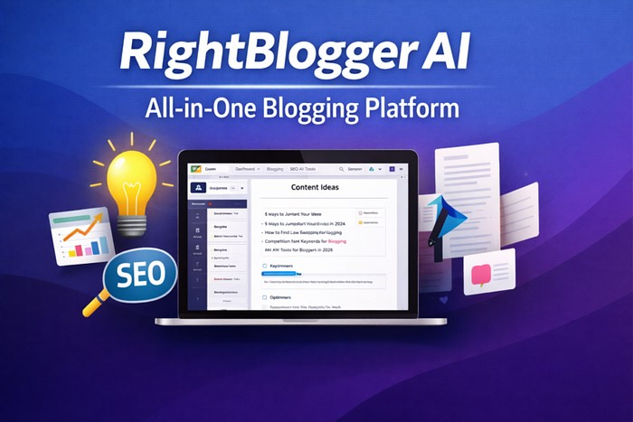

Do you want to create your blog content, product descriptions, social media campaigns, or ad copy ten times faster? 

AI models are drastically changing how we generate content. So, you’re behind if you are doing all the work manually. Which AI writing tools are worth considering? That’s where this guide chips in. I’ll introduce you to the **best AI writing tools for bloggers in 2026**. These AI content generators will blow your mind. 

Whether you’re an experienced content writer or starting your first blog, this comparison will help you pick the best writing assistant for your use case. 

## How We Evaluated These AI Writing Tools 
With so many AI models, how do you choose the **best AI writing tools for bloggers**? There isn’t a definitive way to choose an AI writer. However, there are a few criteria you can consider. 

### Ease of Use 
An AI assistant is only valuable for a blogger, content manager, SEO specialist, or sales lead manager if they [can use it without a steep learning curve](https://cleartechexplained.pages.dev/blog/how-bloggers-use-ai-writing-tools/). You have to ask yourself if you can use the AI writer without tutorials, especially if you are a beginner. Not only have I assessed the friendliness of the user interface, but also the overall navigation and the intuitiveness of the prompt input. 

### Content Quality 
Whether you’re an essay writer, blog post writer, sales lead manager, or marketing ops manager, quality matters a lot when choosing an AI tool. 

Does the artificial intelligence output sound practical and natural? What’s the originality, coherence, relevance, and overall readability of the AI-generated content? Does the model generate engaging content that requires minimal human input and editing? 

These are the questions I considered when assessing content quality. The AI tool you choose should captivate the user and deliver value in the content it generates. 

### Best Use Cases 
Choosing appropriate AI writing assistants is crucial. This ensures the AI-generated content aligns with your application goals and meets quality standards. AI content generators vary greatly in architecture and data-handling capabilities. 

So, choosing the ideal artificial intelligence tool involves careful consideration. Is the AI model suitable for short or long-form content? The AI model should not hinder your content workflow. What type of data can the tool generate? Consider whether the model can generate text, audio, images, or video. 

For instance, you can choose an AI assistant that works as an image generator, or a model designed for SEO writing and content optimization. 

I’ll recommend the **best AI writing tools for bloggers** for different use cases to make it easier for you to find what you need. 

### Pricing 
Your budget plays a significant role in which AI writing tool you can settle for. They vary significantly in cost and features. 

Some offer free versions and premium subscriptions, while others are subscription-based. I narrowed down the list of the **best AI writing tools for bloggers** by considering what they offer at different price points.

If you’re working with a limited budget, choosing a model with a free trial or free version is crucial. Keep in mind, though, free versions may have limitations that may hinder your content workflow. 

## Top 5 AI Writing Tools for Bloggers in 2026
Here are the **best AI writing tools for bloggers in 2026**:

### RightBlogger AI – All-in-One Choice for Bloggers 

With the [RightBlogger AI](https://rightblogger.com/) tool, you can handle all your content creation needs. Its unique design can help you with your workflow. 

This AI assistant includes 90+ tools for bloggers and content creators. These tools cover everything content writers need, including keyword research and blog content writing tools. Brainstorming content ideas is easy with ideation tools for blogging and social media posts. The platform’s content creation tools make it easier and faster to produce content. 

#### Key Features
- AI article writer 
- 90+ writing and marketing tools 
- MyTone (for training the AI to sound like you)
- Auto-generate and publish posts
- Visual calendar scheduling 
- YouTube to blog automation 
- Keyword difficulty scores
- Search volume and competition data
- LLM search optimization 
- SEO reports and analysis
- AutoOptimize for target keywords 

#### Pricing 
You can test drive the RightBlogger AI for free or subscribe to one of the available plans. The model has three plans: Lite, Pro, and Business. You can subscribe monthly or yearly. The platform’s most popular plan is the Pro option at $29.99. 

#### Pros 
- All-in-one option for bloggers 
- User-friendly interface
- Unlimited words on paid plans
- Has a free trial
- Offers integrations and it’s multilingual 

#### Cons 
- Content may sound generic on the free version 
- Requires human input for accuracy, brand voice, and fact-checking 

### Jasper AI – Best for Agencies and Teams 
[Jasper AI](https://cleartechexplained.pages.dev/blog/jasper-ai-review/) is one of the best content creation tools for agencies and teams. With this AI tool, you can create blog posts, marketing copy, product descriptions, Facebook ads, and stunning AI images.

It harnesses advanced machine learning and artificial intelligence to accelerate your content creation process, making it faster, more engaging, and more effective. Jasper AI model can elevate your writing style and design. With Jasper AI, you get a wide range of features that stand out.   

You can create short and long-form blog posts. These include how-to guides, instructional posts, thought content pieces, and listicles. Jasper AI provides a blogger with a detailed structure. The structure saves you time and ensures your content is organized. 

Why is the [Jasper AI](https://www.jasper.ai/) model great for agencies and teams? This AI assistant ensures your team has the tools it needs to scale content and move faster. With over fifty optimized content templates, Jasper is great for marketers. Not only does this AI automate the content lifecycle, but it also connects workflows and unifies brand voice. 

#### Key Features 
- Marketing IQ for optimizing content
- Jasper IQ for context-rich output
- Brand IQ for maintaining brand consistency 
- Purpose-built artificial intelligence agents
- Adapts content for different audiences
- Generates channel-ready assets 
- Can align with approved claims and technical references 
- Fits into comprehensive launch workflows
- AI copilot for marketing 

#### Pricing 
Jasper AI offers two plans: The Business and Pro packages. The pro plan starts at $59 a month. You can start with the Pro plan, which includes a 7-day free trial and is suitable for teams. The business plan offers custom pricing with unlimited audiences, unlimited brand voice, unlimited multi-modal knowledge assets, and unlimited visual guidelines. 

#### Pros
- Draft content quickly
- Great at overcoming writer’s block
- Designed for teams and agencies
- Easy to scale content production 
- Unifies your brand voice 
- Purpose-built for content automation

#### Cons 
- Highly technical documentation 
- Limited free or trial plan 
- More expensive than general-purpose AI tools 

### Surfer AI – Best SEO Strategy and SEO Integration 
Are you a fan of SurferSEO? It’s one of the best SEO tools for creating high-ranking content pieces. The same brand launched Surfer AI. This is an AI writing model built on top of SurferSEO. 

What makes Surfer AI stand out is its capability to use real data to create SEO-optimized drafts. Its SEO strategy combines on-page optimization, competitor analysis, content structure, and keyword research into a single workflow. 

Its unique content creation process makes Surfer AI impressive. The model builds a standout outline by analyzing search intent and identifying ranking patterns. It removes guesswork for marketers and writers. 

[Surfer AI](https://surferseo.com/ai/) integrates with Surfer content editor. Why is this important? It allows you to create long-form content that meets crucial SEO requirements. This makes Surfer AI invaluable for bloggers, content teams, businesses, and agencies that rely on organic traffic. 

#### Key Features 
- Supports eleven languages 
- SERP-based tone of voice 
- Integration with Surfer content editor 
- Surfy AI assistant 
- Built-in templates 
- AI detector 
- Auto-insert images 
- Internal linking 

#### Pricing 
Surfer AI offers three plans: Enterprise, Scale, and Essential. The most affordable package is the Essential plan, which starts at $79. However, this model doesn’t offer a direct free trial. 

#### Pros 
- Gives content creators more control 
- Integration with Surfer content editor 
- Easy to do brand customization
- Deep and detailed SERP analysis
- Time-saving SEO strategy 
- Built-in tools 

#### Cons 
- Doesn’t offer a free trial 

### Copy.ai – Best for Short-Form Marketing Copy 
Is go-to-market content creation what you are interested in? [Copy.ai](https://cleartechexplained.pages.dev/blog/copy-ai-review/) is what you need. This AI assistant shines at producing short-form marketing copy, such as social media posts, emails, and ad copy. It uses natural language processing to generate creative and relevant suggestions. 

Creating advertising copy and marketing campaigns is easy with Copy.ai. Whether you are working on display ads, Google ads, Facebook ads, or any other social media content, this AI tool will get the job done. It uses human input and goals to generate marketing copy. Not to mention the wide selection of templates. 

Are you working with teams? If so, [Copy.ai](https://www.copy.ai/) can boost productivity within your teams. Teams can not only collaborate in real time, but also share feedback. This ensures the produced content aligns with the objectives of the business. 

#### Key Features 
- User-friendly interface 
- Large library of templates 
- Unlimited words in chat 
- Brand voice customization 
- Collaboration tools for teams 
- Built-in editor and tone control

#### Pricing 
Copy.ai offers two plans: Self-Serve and Enterprise. The Self-Serve starts at 29 USD per month. 

#### Pros
- Efficient for creating short-form content
- Ideal for social media posts and content marketing
- Excellent for marketing copy
- Intuitive and user-friendly templates 
- Workflow tools for managing content creation
- Unlimited words in chat

#### Cons 
- Not ideal for long-form, complex content 
- Quality depends on the prompt
- SEO limitations 

### Writesonic AI – Most Convenient Start Free Trial
[Writesonic](https://writesonic.com/) is among the best AI writing tools for bloggers, blending human creativity with AI power. The model can help you scale content creation and output without changing your values. 

It’s a reliable platform for creating short and long-form content. You can generate SEO descriptions, blog posts, product descriptions, and any web content you can think of. It includes multiple resourceful features for bloggers, including a content engine, SEO, AI visibility actions, AI visibility tracking, an AI article writer, and a content optimizer. 

The most convenient Writesonic feature is the free trial. You can test drive the AI model for free with AI content and SEO tools. You don’t need a credit card to start the free trial. 

#### Key Features 
- Content strategy
- Content creation
- Content optimization
- SEO audit and fixes
- SEO AI agent
- AI search volume explorer
- AI visibility action center
- AI visibility tracking

#### Pricing 
Writesonic offers several plans: Enterprise, Advanced, Professional, Standard, and Lite. The Lite plan is the most affordable, starting at $39 per month. The Lite and Standard plans have a free trial. 

#### Pros 
- Convenient free trial 
- Many templates for emails, product descriptions, ads, and blogs
- Intuitive interface
- Time-saving content creation process
- Integrates with GPT-4
- Built-in SEO tools 

#### Cons 
- May experience bugs and glitches
- Steep learning curve when mastering advanced features 

## The Bottom Line 
The use of AI writing models is no longer a futuristic concept. More and more bloggers, content marketers, and sales lead managers use AI tools for content creation. 

AI tools offer unparalleled benefits, including fast content creation, refining writing style and brand voice, optimizing content for Google, and overcoming writer’s block. These AI writing assistants can save you a lot of time when generating content, but you have to pick the right one for your needs. For instance, the **best overall is RightBlogger**, **the best for agencies and teams is Jasper**, and **the best SEO tool is Surfer AI**. 

With that said, if you want to create high-quality content that ranks high on SERPs, the best approach is to use the right AI model along with human editing.  

👉 Browse more guides on the [ClearTechExplained blog](https://cleartechexplained.pages.dev/blog/) to continue learning.
